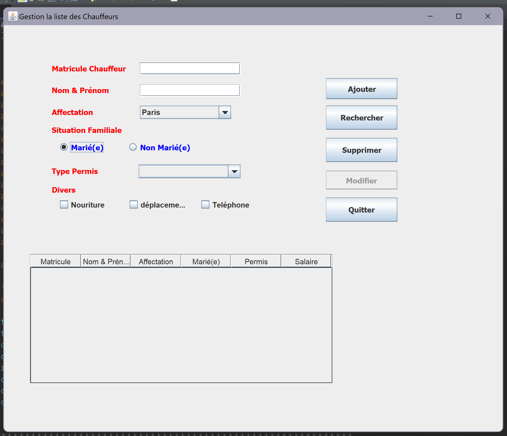
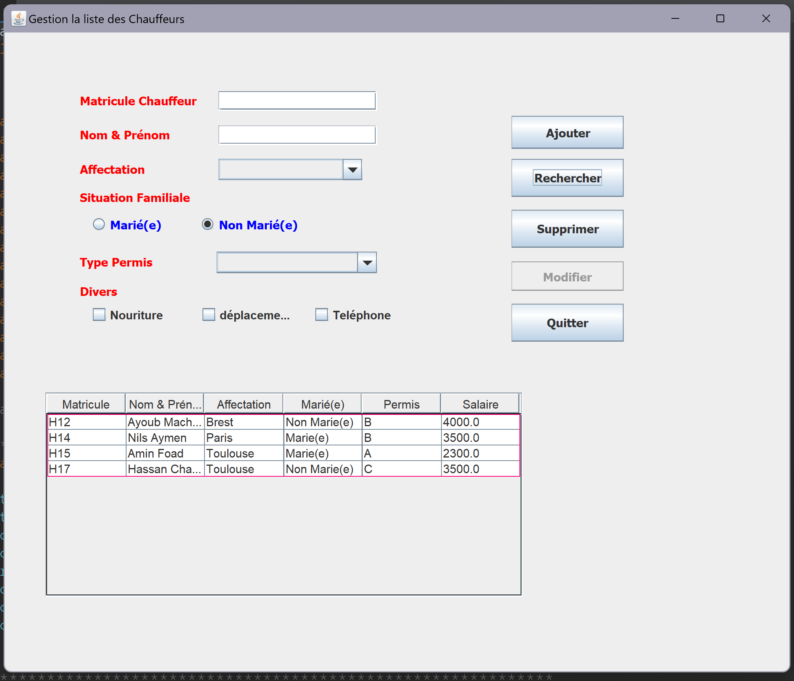

# What is Swing?
Swing is a part of Java's standard library used for creating graphical user interfaces (GUIs). 
It provides a set of "widgets" (like buttons, text fields, tables, and more) that can be used to build interactive desktop applications.
In this project, Swing is used to create the user interface that allows the user to input chauffeur details, modify records, and interact with the system.

# Chauffeur Management System
This project is a Java Swing CRUD (Create, Read, Update, Delete) application for managing chauffeurs. 
It allows users to perform basic operations such as adding, searching, deleting, and modifying chauffeur records.
The application is built using Java Swing for the graphical user interface (GUI) and provides a simple, intuitive interface for interacting with the data.

## Features
- Add new chauffeurs to the system, including details such as name, marital status, license type, and salary.
- Search for chauffeurs by entering their details (matricule, name, etc.).
- Delete chauffeur entries from the system.
- Update chauffeur details if any information changes.
- Display all chauffeurs in a table format for easy overview and management.
- Quit the application safely with the "Quitter" button.

## Salary Calculation
The application features a table at the bottom of the interface that displays all the chauffeurs added to the system. The table contains the following columns:

- Matricule: Chauffeur's unique ID
- Nom & Prénom: Full name of the chauffeur
- Affectation: City or region where the chauffeur is assigned
- Situation Familiale: Marital status (Married or Not Married)
- Type de Permis: Type of driving license (A, B, C, etc.)
- Salaire: Salary, which is calculated based on the type of license (Type de Permis) and additional benefits like Nourriture, Déplacement, and Téléphone.

# Screenshots

\

